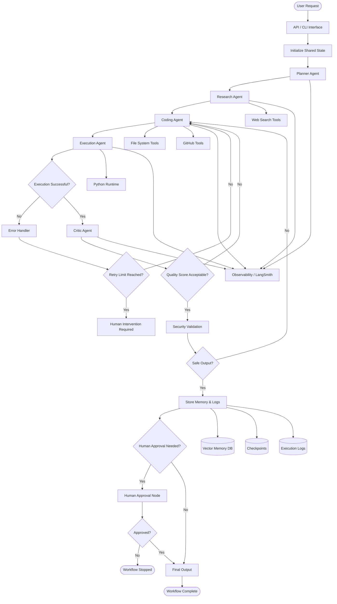

# 🚀 OmniAgent : Autonomous Research & Coding Agent Platform

> A production-grade multi-agent AI system built using LangGraph that can research, plan, code, execute, debug, review, and improve software autonomously.

---

# 🌟 Core Philosophy

Instead of simple chatbots, this system replicates how **real engineering teams collaborate**:

```
User Request → Multi-Stage Processing → Autonomous Execution → Quality Assurance → Human Review
```

Each agent operates independently with:
- **Specialized roles** - Planning, research, coding, execution, critique
- **Tool access** - Web search, code execution, file operations, GitHub integration
- **Memory integration** - Context awareness from past operations
- **Decision-making authority** - Agents route workflow based on outcomes

---

# 🧠 What This Project Is

This is an advanced **AI orchestration platform** where multiple AI agents collaborate through a graph-based workflow.

The system mimics how real engineering teams work.

Example workflow:

```text
User → Planner → Researcher → Coder → Executor → Critic → Human Approval → Final Output
```

Each AI agent has:
- a role
- memory
- tools
- responsibilities
- decision-making capability

---

# ❓ Why Build This?

Modern AI applications are evolving from:
- simple prompts
- single-response chatbots

to:

✅ autonomous systems  
✅ collaborative agents  
✅ self-correcting workflows  
✅ long-running reasoning systems  

This project helps practice:
- Agent Engineering
- Workflow Orchestration
- AI Reliability
- Production AI Design
- Autonomous Debugging
- Stateful Systems
- Multi-Agent Collaboration

---

# 🎯 Main Goals

The project aims to:

- Build a production-style agentic AI system
- Learn advanced LangGraph concepts
- Create autonomous execution loops
- Practice real-world AI architecture
- Implement self-healing workflows
- Explore memory & persistence
- Simulate enterprise-grade AI systems

---

# 🔥 Core Features

# 1. Multi-Agent Architecture

Different AI agents specialize in different tasks.

| Agent | Responsibility |
|---|---|
| Planner Agent | Breaks goals into tasks |
| Research Agent | Searches web/docs/repos |
| Coding Agent | Generates code |
| Execution Agent | Runs generated code |
| Critic Agent | Reviews outputs |
| Memory Agent | Stores long-term knowledge |
| Human Approval Node | Adds safety layer |

---

# 2. Graph-Based Workflow

The entire system runs using LangGraph stateful workflows.

Unlike traditional pipelines:
- nodes can loop
- retry
- branch
- pause
- recover

---

# 3. Autonomous Debugging

The platform can:
1. generate code
2. execute it
3. detect errors
4. fix issues automatically
5. retry execution

Example:

```text
Generate Code
      ↓
Run Program
      ↓
Error?
   YES → Fix → Retry
      ↓
Success
```

---

# 4. Human-in-the-Loop

Critical actions require human approval.

Examples:
- deployment
- deleting files
- expensive API calls
- database modifications

This makes the system safer and more production-ready.

---

# 5. Persistent Memory

The platform remembers:
- previous tasks
- coding patterns
- successful fixes
- user preferences
- execution history

# 🚀 Quick Start

## Prerequisites

- Python 3.10+
- Docker (for sandbox execution)
- API keys: OpenAI, Tavily, SerpAPI (optional)

## Installation

```bash
# Clone repository
git clone https://github.com/raj-tembe/OmniAgent.git
cd OmniAgent

# Create virtual environment
python -m venv .venv
source .venv/bin/activate  # On Windows: .venv\\Scripts\\activate

# Install dependencies
pip install -r requirements.txt

# Configure environment
cp .env.example .env
# Edit .env with your API keys
```

## Basic Usage

```bash
python main.py "Build a FastAPI authentication service" [--interactive] [--verbose]
```

## Running the CLI

```bash
python main.py "Build a simple hello world script"
```

---


```text
                        ┌────────────────────┐
                        │      USER          │
                        └─────────┬──────────┘
                                  │
                                  ▼
                    ┌─────────────────────────┐
                    │     Planner Agent       │
                    └─────────┬───────────────┘
                              │
                              ▼
                    ┌─────────────────────────┐
                    │    Research Agent       │
                    └─────────┬───────────────┘
                              │
                              ▼
                    ┌─────────────────────────┐
                    │     Coding Agent        │
                    └─────────┬───────────────┘
                              │
                              ▼
                    ┌─────────────────────────┐
                    │    Execution Agent      │
                    └─────────┬───────────────┘
                              │
                     Error? ──┴──── YES
                              │
                              ▼
                    ┌─────────────────────────┐
                    │      Critic Agent       │
                    └─────────┬───────────────┘
                              │
                   Needs Changes?
                       YES │
                           ▼
                    ┌─────────────────────────┐
                    │     Coding Agent        │
                    └─────────────────────────┘

                              │ NO
                              ▼
                    ┌─────────────────────────┐
                    │  Human Approval Node    │
                    └─────────┬───────────────┘
                              │
                              ▼
                    ┌─────────────────────────┐
                    │      Final Output       │
                    └─────────────────────────┘
```

---

# ⚙️ How It Works

# Step 1 — User Request

The user provides a goal.

Example:

```text
Build a Flask authentication API using JWT.
```

---

# Step 2 — Planning Phase

The Planner Agent:
- analyzes the request
- creates task breakdowns
- determines execution strategy

Example:

```text
1. Setup Flask app
2. Create JWT auth
3. Add database
4. Create APIs
5. Add tests
6. Generate README
```

---

# Step 3 — Research Phase

The Research Agent:
- searches documentation
- checks APIs
- finds best practices
- gathers implementation references

---

# Step 4 — Code Generation

The Coding Agent:
- generates files
- creates project structure
- writes logic
- creates tests
- updates state

---

# Step 5 — Execution

The Execution Agent:
- runs code inside a sandbox
- captures logs/errors
- validates outputs

---

# Step 6 — Self-Healing Loop

If execution fails:

```text
Error → Diagnose → Repair → Retry
```

The agent automatically attempts fixes.

---

# Step 7 — Critic Review

The Critic Agent reviews:
- code quality
- correctness
- hallucinations
- security vulnerabilities
- architecture

---

# Step 8 — Human Approval

High-risk actions pause execution until approved.

---

# Step 9 — Final Delivery

The system returns:
- source code
- documentation
- reports
- logs
- architecture explanations

---

# 🧩 LangGraph Concepts Used

| Concept | Usage |
|---|---|
| Stateful Graphs | Workflow orchestration |
| Conditional Edges | Error routing |
| Cyclic Graphs | Repair loops |
| Parallel Branches | Concurrent research |
| Interrupts | Human approval |
| Checkpointing | Persistence |
| Tool Calling | Web/Python/File tools |
| Memory | Long-term context |
| Multi-Agent Systems | Specialized AI workers |

---

# 🧠 Shared State Design

The graph uses a centralized state object.

Example:

```python
class AgentState(TypedDict):
    user_request: str
    plan: list
    current_task: str
    generated_code: dict
    execution_logs: str
    error: str
    critic_feedback: str
    approved: bool
```

Every node can:
- read state
- modify state
- route workflow

---

# 🔄 Workflow Design




---

# � Technology Stack

| Layer | Technology | Purpose |
|-------|-----------|----------|
| **Orchestration** | LangGraph | Stateful workflow management |
| **Language Models** | OpenAI / Groq / Gemini | Agent reasoning |
| **Backend** | FastAPI | REST API & WebSocket |
| **Frontend** | Next.js | Web dashboard |
| **Memory Storage** | ChromaDB | Vector embeddings & semantic search |
| **Checkpoints** | SQLite / PostgreSQL | Workflow persistence |
| **Execution** | Docker | Isolated code sandbox |
| **Observability** | LangSmith | Tracing & debugging |
| **Code Quality** | Pydantic | Type validation & schemas |

---

# 📂 Proposed Project Structure

```text
OMNIAGENT/
│
├── README.md
├── requirements.txt
├── .env
├── .gitignore
├── main.py
├── config.py
│
├── agents/
│   ├── __init__.py
│   │
│   ├── planner/
│   │   ├── planner_agent.py
│   │   ├── planner_prompt.py
│   │   ├── planner_schema.py
│   │   └── planner_utils.py
│   │
│   ├── coder/
│   │   ├── coder_agent.py
│   │   ├── coder_prompt.py
│   │   ├── coder_schema.py
│   │   └── coder_utils.py
│   │
│   ├── executor/
│   │   ├── executor_agent.py
│   │   ├── sandbox_runner.py
│   │   ├── docker_runner.py
│   │   └── execution_utils.py
│   │
│   ├── critic/
│   │   ├── critic_agent.py
│   │   ├── critic_prompt.py
│   │   ├── critic_schema.py
│   │   └── critic_utils.py
│   │
│   ├── researcher/
│   │   ├── researcher_agent.py
│   │   ├── researcher_prompt.py
│   │   ├── researcher_schema.py
│   │   └── researcher_utils.py
│   │
│   └── memory/
│       ├── memory_agent.py
│       ├── memory_manager.py
│       └── retrieval.py
│
├── graph/
│   ├── __init__.py
│   │
│   ├── state.py
│   ├── workflow.py
│   ├── router.py
│   ├── nodes.py
│   ├── edges.py
│   ├── conditional_edges.py
│   ├── checkpoint.py
│   └── graph_visualizer.py
│
├── tools/
│   ├── __init__.py
│   │
│   ├── web_tools/
│   │   ├── tavily_search.py
│   │   ├── serpapi_search.py
│   │   └── arxiv_search.py
│   │
│   ├── code_tools/
│   │   ├── python_repl.py
│   │   ├── file_writer.py
│   │   ├── file_reader.py
│   │   └── terminal_runner.py
│   │
│   ├── github_tools/
│   │   ├── github_search.py
│   │   ├── repo_analyzer.py
│   │   └── commit_generator.py
│   │
│   └── validation_tools/
│       ├── syntax_checker.py
│       ├── dependency_checker.py
│       └── security_checker.py
│
├── prompts/
│   ├── planner_prompt.md
│   ├── coder_prompt.md
│   ├── critic_prompt.md
│   ├── researcher_prompt.md
│   └── system_prompt.md
│
├── schemas/
│   ├── planner_schema.py
│   ├── coder_schema.py
│   ├── critic_schema.py
│   ├── execution_schema.py
│   └── shared_schema.py
│
├── memory/
│   ├── vector_store/
│   │   ├── chroma_store.py
│   │   └── embeddings.py
│   │
│   ├── checkpoints/
│   │   ├── sqlite_checkpoint.py
│   │   └── postgres_checkpoint.py
│   │
│   └── conversation_memory/
│       ├── short_term.py
│       └── long_term.py
│
├── execution/
│   ├── sandbox/
│   │   ├── sandbox_manager.py
│   │   ├── docker_executor.py
│   │   └── isolated_runner.py
│   │
│   ├── logs/
│   │   ├── execution_logs/
│   │   └── error_logs/
│   │
│   └── generated_projects/
│
├── api/
│   ├── app.py
│   ├── routes.py
│   ├── websocket.py
│   └── middleware.py
│
├── frontend/
│   ├── dashboard/
│   ├── workflow_visualizer/
│   ├── execution_monitor/
│   └── memory_viewer/
│
├── database/
│   ├── models.py
│   ├── db.py
│   └── migrations/
│
├── observability/
│   ├── langsmith_tracing.py
│   ├── metrics.py
│   ├── monitoring.py
│   └── token_tracking.py
│
├── tests/
│   ├── test_agents/
│   ├── test_graph/
│   ├── test_tools/
│   ├── test_execution/
│   └── integration_tests/
│
├── docs/
│   ├── architecture.md
│   ├── workflow.md
│   ├── agent_design.md
│   ├── memory_system.md
│   └── deployment.md
│
├── notebooks/
│   ├── experiments/
│   ├── prompt_testing/
│   └── langgraph_learning/
│
├── docker/
│   ├── Dockerfile
│   ├── docker-compose.yml
│   └── sandbox.Dockerfile
│
├── scripts/
│   ├── setup.sh
│   ├── run_dev.sh
│   ├── start_server.sh
│   └── clean_logs.sh
│
└── assets/
    ├── architecture_diagrams/
    ├── screenshots/
    └── workflow_images/

```

---

# 🔒 Safety & Reliability

Production-grade safety mechanisms:

| Feature | Purpose |
|---------|----------|
| **Human Approval Layers** | Critical operations require explicit human authorization |
| **Execution Sandboxes** | All code runs in isolated Docker containers |
| **Retry Logic** | Automatic recovery with configurable attempt limits |
| **Validation Nodes** | Code quality & security checks before execution |
| **Isolated Environments** | No access to host system from running code |
| **Comprehensive Logging** | Full audit trail of all operations |
| **Error Containment** | Failures don't cascade to other agents |

---

# ✅ Currently Completed Work

## Core Architecture ✓
- ✅ **Multi-agent system** - Full LangGraph-based orchestration
- ✅ **Seven specialized agents**:
  - Planner Agent - Task decomposition & strategy
  - Researcher Agent - Web & documentation search
  - Coder Agent - Code generation & project scaffolding
  - Executor Agent - Docker & sandbox-based execution
  - Critic Agent - Quality & security review
  - Memory Agent - Long-term knowledge management
  - Human Approval Node - Safety layer for critical operations
- ✅ **Centralized state management** - TypedDict-based shared state across all agents
- ✅ **Intelligent error handling** - Automatic repair loops with retry logic
- ✅ **Conditional routing** - Dynamic workflow paths based on execution results

## Tools & Integration ✓
- ✅ **Web Search Suite**
  - Tavily API integration
  - SerpAPI integration
  - ArXiv academic search
- ✅ **Code Execution Tools**
  - Python REPL with isolated execution
  - File reader/writer system
  - Terminal runner with command execution
- ✅ **GitHub Integration**
  - Repository analyzer
  - Commit message generator
  - Code search capabilities
- ✅ **Code Quality & Security**
  - Python syntax checker
  - Dependency analyzer
  - Security vulnerability scanner
- ✅ **Sandbox Execution**
  - Docker-based isolated environments
  - Sandbox runner for code isolation
  - Execution log capture & analysis

## Memory & Persistence ✓
- ✅ **Vector Store** - ChromaDB with semantic search
- ✅ **Checkpoint System** - SQLite & PostgreSQL support for workflow recovery
- ✅ **Conversation Memory**
  - Short-term context window
  - Long-term knowledge retention
- ✅ **Execution Tracking** - Comprehensive logging of all operations
- ✅ **Project Artifacts** - Generated code storage & retrieval

## Infrastructure & Observability ✓
- ✅ **LangGraph Workflow Engine** - Complete graph-based orchestration
- ✅ **LangSmith Integration** - Full observability & tracing
- ✅ **FastAPI Backend** - REST API interface
- ✅ **Type Safety** - Pydantic schemas for all data structures
- ✅ **Modular Design** - Extensible agent & tool architecture
- ✅ **Docker Support** - Container-based deployment

## Workflow Capabilities ✓
- ✅ **Multi-stage processing** - Request → Plan → Research → Code → Execute → Review
- ✅ **Error recovery** - Automatic detection and repair of failures
- ✅ **Quality gates** - Critic validation before approval
- ✅ **Human oversight** - Interrupt points for critical decisions
- ✅ **Memory integration** - Context-aware suggestions based on history

---

# 🎯 Next Phase: Binary Package Development
## ACRA : Autonomous Coding & Research Agent
## Vision: Enterprise-Grade CLI Tool

Transforming OmniAgent into a **production-ready binary CLI tool** comparable to:
- **Claude CLI** - Anthropic's command-line interface  
- **Copilot CLI** - GitHub's Copilot command-line tool  
- **Devin API** - Autonomous software engineering platform

## OmniAgent CLI Command Reference

OmniAgent is a multi-provider agentic CLI for setup, task execution, memory, debugging, and project workflows.

## At a glance

* **CLI name:** `acra`
* **Package:** `acra`
* **Providers:** Gemini, OpenAI, Ollama, HuggingFace, Groq, Mistral, Anthropic, and custom endpoints
* **Core flow:** `acra serve` → provider selection → model + API key → theme + tone → workspace → ready

## First run

On the first launch, `acra serve` opens the setup wizard and guides the user through:

1. Choosing a provider
2. Selecting a model
3. Entering an API key or endpoint
4. Entering a research API key (Tavily & Serpapi)
5. Picking a theme and tone
6. Setting the workspace

After setup, OmniAgent loads the saved profile automatically on later runs.

## Setup and configuration

| Command                     | Description                                                                                                                                                                    |
| --------------------------- | ------------------------------------------------------------------------------------------------------------------------------------------------------------------------------ |
| `acra serve [entry]`        | Start OmniAgent. On first run, opens the setup wizard. On later runs, loads the saved profile and opens the prompt directly. Respects `--profile` to switch configurations.    |
| `acra init`                 | Re-run the full setup wizard from scratch. Useful when switching providers, resetting preferences, or onboarding a new project. Existing config is backed up before overwrite. |
| `acra config`               | Open the saved config in `$EDITOR` for manual editing.                                                                                                                         |
| `acra config <key> <value>` | Set a single configuration value inline, such as `acra config tone concise` or `acra config theme monokai`.                                                                    |
| `acra config --list`        | Display all current config values in a readable table.                                                                                                                         |
| `acra update`               | Check PyPI for a newer version of `acra-agent` and upgrade if available. Shows a changelog summary after update.                                                               |

## Brain management

| Command                        | Description                                                                                                                                     |
| ------------------------------ | ----------------------------------------------------------------------------------------------------------------------------------------------- |
| `acra brain [interactive]`     | Open the brain picker. Choose a provider, model, and API key or endpoint, then save to the active profile.                                      |
| `acra brain --list`            | Show all configured brains across profiles, including the active one.                                                                           |
| `acra brain use <name>`        | Switch to a saved brain by name. Applies to the next `acra serve` or `acra ask`.                                                                |
| `acra brain add`               | Add a new brain without replacing the current one. Useful for local or secondary providers.                                                     |
| `acra brain remove <name>`     | Remove a saved brain by name. Confirms before removing the active brain.                                                                        |
| `acra brain test`              | Send a minimal test prompt to the active brain and report latency, token count, and response.                                                   |
| `acra brain models [provider]` | List available models for a provider. For local providers, shows locally available models; for hosted providers, fetches the latest model list. |

## Agent tasks

| Command                       | Description                                                                                                                                               |
| ----------------------------- | --------------------------------------------------------------------------------------------------------------------------------------------------------- |
| `acra ask "<prompt>" [agent]` | Run a single task without entering the interactive session. Executes the planner → researcher → coder → executor → critic pipeline and prints the result. |
| `acra build "<description>"`  | Generate and run a complete project from a description. Writes output to the configured workspace. Supports `--dry-run`.                                  |
| `acra fix [file]`             | Analyze a file or the entire workspace for bugs, run the critic pipeline, and apply suggested fixes. Shows a diff before writing. Supports `--auto`.      |
| `acra review [file]`          | Run the critic agent only. Returns structured feedback with bugs, style issues, security concerns, and a quality score out of 10.                         |
| `acra explain [file]`         | Explain a file or codebase in human-readable form. Includes a summary, architecture overview, and per-function breakdown.                                 |
| `acra research "<topic>"`     | Run only the researcher agent and return structured findings, references, and snippets. No code generation or execution.                                  |
| `acra run [file]`             | Run a generated project or a specific file in the sandbox runner. Captures stdout, stderr, and exit code. Supports `--docker`.                            |

## Context and memory

| Command                             | Description                                                                                                           |
| ----------------------------------- | --------------------------------------------------------------------------------------------------------------------- |
| `acra context add <path> [context]` | Add a file or directory to the active session context. Supports glob patterns such as `src/**/*.py`.                  |
| `acra context list`                 | Show files currently in the session context, including size, token estimate, and embedding status.                    |
| `acra context clear`                | Remove all files from the current session context. Does not delete memory.                                            |
| `acra memory list`                  | List stored memory entries for the current session, including type, timestamp, and a short preview. Supports `--all`. |
| `acra memory clear`                 | Wipe all memory for the current session. Supports `--session <id>` for a specific past session.                       |
| `acra memory search "<query>"`      | Search stored memories semantically and return the most relevant matches with similarity scores.                      |
| `acra session list`                 | List past sessions with IDs, timestamps, and last task summaries.                                                     |
| `acra session resume <id>`          | Resume a previous session and restore messages, memory, and graph position.                                           |

## Utilities

| Command                           | Description                                                                                                                                             |
| --------------------------------- | ------------------------------------------------------------------------------------------------------------------------------------------------------- |
| `acra keys set <provider> [util]` | Save an API key securely to the OS keyring. Nothing is stored in plaintext config.                                                                      |
| `acra keys list`                  | Show which providers have saved keys, using masked values only.                                                                                         |
| `acra keys delete <provider>`     | Remove a stored API key from the keyring.                                                                                                               |
| `acra logs`                       | Tail live agent logs, including inputs, outputs, routing decisions, and token usage. Supports `--session <id>` and `--level debug`.                     |
| `acra stats`                      | Show usage statistics for the current session or all time, including tasks run, tokens used, average quality score, retry rate, and most-used commands. |
| `acra workspace [path]`           | Set or display the active workspace directory. Without arguments, prints the current workspace.                                                         |

## Dev and advanced commands

| Command                     | Description                                                                                            |                                                                                                    |
| --------------------------- | ------------------------------------------------------------------------------------------------------ | -------------------------------------------------------------------------------------------------- |
| `acra graph show [dev]`     | Print a text-mode diagram of the active LangGraph workflow, including nodes, edges, and routing rules. |                                                                                                    |
| `acra graph run "<prompt>"` | Run a prompt like `acra ask`, but show each node’s input and output state step by step.                |                                                                                                    |
| `acra plugin list`          | List installed plugin tools from `~/.acra/plugins/`.                                                   |                                                                                                    |
| `acra plugin add <path url>`| Install a plugin from a local path or GitHub URL after validating its `register_tool()` signature. |
| `acra --version`            | Print the installed version of `acra-agent` along with Python, LangGraph, and LangChain versions.      |                                                                                                    |
| `acra --help`               | Print the full help text. Append `--help` to any subcommand for contextual help.                       |                                                                                                    |

## Global flags

These flags work across commands.

| Flag                  | Description                                                                                                                   |
| --------------------- | ----------------------------------------------------------------------------------------------------------------------------- |
| `--profile <name>`    | Use a named config profile instead of the default. Each profile can have its own brain, theme, workspace, and memory backend. |
| `--workspace <path>`  | Temporarily override the workspace directory for this invocation only.                                                        |
| `--no-memory`         | Run without reading or writing to memory. Useful for isolated one-off tasks.                                                  |
| `--dry-run`           | Plan and generate without executing code or writing files.                                                                    |
| `--json`              | Return output as JSON instead of formatted text.                                                                              |
| `--verbose`, `-v`     | Show routing, state diffs, and tool calls while the agent runs.                                                               |
| `--quiet`, `-q`       | Suppress all output except the final result.                                                                                  |
| `--timeout <seconds>` | Override the default execution timeout.                                                                                       |

## Recommended command flow

* Start with `acra serve` for interactive use.
* Use `acra brain` or `acra init` when changing providers or resetting setup.
* Use `acra ask`, `acra build`, `acra fix`, or `acra review` for day-to-day work.
* Use `acra context`, `acra memory`, and `acra session` when working with long-running projects.
* Use `acra logs`, `acra stats`, and `acra graph show` for debugging and observability.

---

# 📈 Future Enhancements

Potential upgrades:

- 🎯 **Binary packaging** (PyInstaller, Nuitka)
- 🎤 Voice-based agents
- 🚀 Autonomous deployment
- 🎨 Multi-modal reasoning
- 📄 PDF understanding
- 🔗 Advanced GitHub integration
- 🧠 Enhanced long-term memory systems
- 🎨 AI-generated UI components
- 👥 Multi-user collaboration
- 🤝 Agent communication protocols
- ⚡ Real-time streaming responses
- 📊 Advanced analytics dashboard

---

# 🌍 Real-World Inspiration

This project is inspired by:
- OpenAI Codex Agents
- Devin AI
- AutoGPT
- Claude Code
- Enterprise AI Automation Systems

---

# 🎓 Learning Outcomes

This project provides deep expertise in:

| Area | Learning |
|------|----------|
| **LangGraph** | Advanced state management, conditional routing, checkpointing |
| **Agent Systems** | Designing specialized AI workers with specific responsibilities |
| **Orchestration** | Coordinating complex multi-stage workflows |
| **Tool Integration** | Building reliable tool-calling systems |
| **Production AI** | Error handling, observability, safety mechanisms |
| **Memory Systems** | Persistent context, semantic search, long-term reasoning |
| **Autonomous Debugging** | Self-healing loops, error recovery, retry strategies |
| **System Design** | Scalable architecture for AI applications |

---

# 🚀 End Goal

The long-term vision is to create:

> A fully autonomous AI engineering system capable of researching, coding, debugging, reviewing, and improving software with minimal human intervention.

---

## 📖 Documentation

Detailed documentation available in the `docs/` directory:
- [Architecture Deep Dive](docs/architecture.md) - System design and principles
- [Workflow Guide](docs/workflow.md) - Step-by-step execution flow
- [Agent Design](docs/agent_design.md) - Creating custom agents
- [Memory Systems](docs/memory_system.md) - Persistence & retrieval
- [Deployment Guide](docs/deployment.md) - Production setup

---

## 📜 License

MIT License - See LICENSE file for details

---

# ⭐ Final Note

This project is not just another AI chatbot.

It is an exploration into the future of:
- autonomous software engineering
- collaborative AI systems
- intelligent orchestration
- self-improving workflows

Building this will significantly strengthen:
- AI engineering skills
- system design understanding
- production AI architecture knowledge
- LangGraph expertise

---
