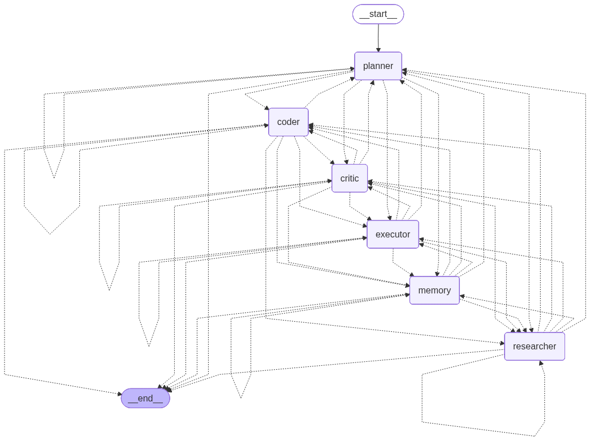

# OmniAgent

OmniAgent is a command-line, LangGraph-powered workflow for turning a software request into a researched, generated, executed, and reviewed project. It coordinates specialized agents for planning, research, coding, execution, critique, memory, and optional human approval.

Generated projects are written outside the repository by default, so using the tool does not overwrite the OmniAgent source tree.



## Workflow

```text
request → planner → researcher → coder → executor → critic → memory → end
                               ↑              │         │
                               └── repair ────┘         └── revise
```

The graph uses conditional routing and a retry limit. The coding agent receives execution errors or critique feedback and can regenerate the project. When interactive mode is enabled and an agent requests approval, the workflow pauses at the human node; in a non-interactive environment, approval is denied automatically.

| Component | What it does |
| --- | --- |
| Planner | Breaks a request into implementation steps. |
| Researcher | Produces structured implementation guidance and sources. |
| Coder | Generates project files and incorporates repair/review feedback. |
| Executor | Saves files, then executes them in a constrained Docker container. Web apps are syntax- and requirements-validated instead of being kept running. |
| Critic | Reviews generated files and execution results, including security concerns. |
| Memory | Persists workflow context and retrieves relevant historical context. |

## Requirements

- Python 3.10 or newer
- Docker, running locally, for generated-project execution
- An LLM provider: Gemini (default), OpenAI, Groq, Ollama, Hugging Face local, or Hugging Face cloud

Optional integrations need their own credentials: Tavily, SerpAPI, GitHub, and LangSmith.

## Setup

```bash
git clone https://github.com/raj-tembe/OmniAgent.git
cd OmniAgent

python -m venv .venv
source .venv/bin/activate            # Windows: .venv\\Scripts\\activate
pip install -r requirements.txt

cp .env.example .env
```

Edit `.env` to select a provider and add the matching credential. For example, to use OpenAI:

```dotenv
LLM_PROVIDER=openai
OPENAI_API_KEY=your_api_key
OPENAI_MODEL=gpt-4o-mini
```

The included dependency set supports every configured provider. If you prefer a provider-specific setup, the helper will install its packages and update `.env`:

```bash
python setup_llm.py gemini
python setup_llm.py openai
python setup_llm.py groq
python setup_llm.py ollama
```

See [the provider guide](docs/LLM_PROVIDER_GUIDE.md) for all provider settings and [the quick reference](docs/LLM_QUICK_START.md) for setup examples.

## Run a workflow

Pass the task as either a positional argument or `--task`:

```bash
python main.py "Build a Python REST API with FastAPI"
python main.py --task "Create a single-file HTML calculator"
python main.py --interactive --verbose "Debug a Node.js memory leak"
```

| Option | Purpose |
| --- | --- |
| `--interactive` | Enables terminal-based approval when a workflow agent requests it. |
| `--verbose` | Enables debug-level logging. |
| `--task TEXT` | Alternative to the positional task argument. |

The CLI prints the execution status, quality score, plan, generated file names, security findings, and the saved-project location. A non-successful execution exits with status `1`.

## Configuration and data

Configuration is read from `.env`; defaults live in [config.py](config.py). The most important variables are:

| Variable | Default | Purpose |
| --- | --- | --- |
| `LLM_PROVIDER` | `gemini` | `gemini`, `openai`, `groq`, `ollama`, `huggingface_local`, or `huggingface_cloud`. |
| `LLM_TEMPERATURE` | `0.6` | Model temperature. |
| `CHECKPOINT_BACKEND` | `sqlite` | `sqlite`, `postgres`, or a fallback in-memory saver. |
| `OMNIAGENT_DATA_DIR` | OS-specific app-data directory | Root for generated projects, memory, model cache, and SQLite checkpoints. |
| `OLLAMA_BASE_URL` | `http://localhost:11434` | Ollama server endpoint. |

By default, generated projects and persisted data are stored under the operating system's user-data directory (for example, `~/.local/share/omniagent` on Linux). Set `OMNIAGENT_DATA_DIR` to put them elsewhere.

## Execution sandbox

Generated files are saved under `<data-dir>/projects/<project-name>`. The executor runs code in the `python:3.11` Docker image with network access disabled, a 256 MB memory limit, one CPU, a process limit, dropped Linux capabilities, and `no-new-privileges` enabled. Docker must be available to run generated projects.

This is a practical containment layer, not a substitute for reviewing generated code before using it in production. The generated-project directory is mounted read/write so that programs can create files inside their own project directory.

## Testing

Run the test suite with:

```bash
pytest
```

Useful focused checks include:

```bash
pytest tests/test_llm.py
pytest tests/test_executor_agent.py
pytest tests/test_checkpoint_backend.py
```

## Repository layout

```text
agents/         Agent implementations and LLM chains
graph/          LangGraph state, routing, nodes, and checkpoint setup
schemas/        Pydantic models for agent outputs and execution results
tools/          Web, GitHub, code, and validation utilities
memory/         Chroma-backed memory and checkpoint backends
execution/      Sandbox and generated-project support
observability/  Metrics, monitoring, token tracking, and LangSmith support
tests/          Unit and integration-style tests
docs/           Provider, checkpoint, and implementation notes
```

## Documentation

- [LLM provider guide](docs/LLM_PROVIDER_GUIDE.md)
- [LLM quick start](docs/LLM_QUICK_START.md)
- [Checkpoint hotfix notes](docs/CHECKPOINT_HOTFIX.md)
- [File structure guide](docs/File_Structure.md)

## License

See [LICENSE](LICENSE).
