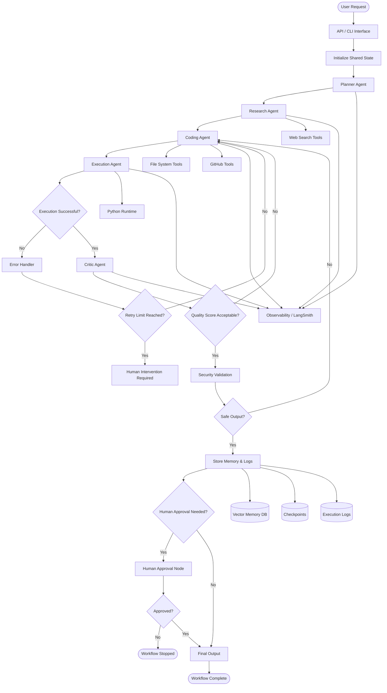

# 📂 OmniAgent — File & Folder Purpose Guide

---

# 🌍 ROOT DIRECTORY
---
```
OMNIAGENT/
│
├── README.md
├── requirements.txt
├── .env
├── .gitignore
├── main.py
├── config.py
│
├── agents/
│   ├── __init__.py
│   │
│   ├── planner/
│   │   ├── planner_agent.py
│   │   ├── planner_prompt.py
│   │   ├── planner_schema.py
│   │   └── planner_utils.py
│   │
│   ├── coder/
│   │   ├── coder_agent.py
│   │   ├── coder_prompt.py
│   │   ├── coder_schema.py
│   │   └── coder_utils.py
│   │
│   ├── executor/
│   │   ├── executor_agent.py
│   │   ├── sandbox_runner.py
│   │   ├── docker_runner.py
│   │   └── execution_utils.py
│   │
│   ├── critic/
│   │   ├── critic_agent.py
│   │   ├── critic_prompt.py
│   │   ├── critic_schema.py
│   │   └── critic_utils.py
│   │
│   ├── researcher/
│   │   ├── researcher_agent.py
│   │   ├── researcher_prompt.py
│   │   ├── researcher_schema.py
│   │   └── researcher_utils.py
│   │
│   └── memory/
│       ├── memory_agent.py
│       ├── memory_manager.py
│       └── retrieval.py
│
├── graph/
│   ├── __init__.py
│   │
│   ├── state.py
│   ├── workflow.py
│   ├── router.py
│   ├── nodes.py
│   ├── edges.py
│   ├── conditional_edges.py
│   ├── checkpoint.py
│   └── graph_visualizer.py
│
├── tools/
│   ├── __init__.py
│   │
│   ├── web_tools/
│   │   ├── tavily_search.py
│   │   ├── serpapi_search.py
│   │   └── arxiv_search.py
│   │
│   ├── code_tools/
│   │   ├── python_repl.py
│   │   ├── file_writer.py
│   │   ├── file_reader.py
│   │   └── terminal_runner.py
│   │
│   ├── github_tools/
│   │   ├── github_search.py
│   │   ├── repo_analyzer.py
│   │   └── commit_generator.py
│   │
│   └── validation_tools/
│       ├── syntax_checker.py
│       ├── dependency_checker.py
│       └── security_checker.py
│
├── prompts/
│   ├── planner_prompt.md
│   ├── coder_prompt.md
│   ├── critic_prompt.md
│   ├── researcher_prompt.md
│   └── system_prompt.md
│
├── schemas/
│   ├── planner_schema.py
│   ├── coder_schema.py
│   ├── critic_schema.py
│   ├── execution_schema.py
│   └── shared_schema.py
│
├── memory/
│   ├── vector_store/
│   │   ├── chroma_store.py
│   │   └── embeddings.py
│   │
│   ├── checkpoints/
│   │   ├── sqlite_checkpoint.py
│   │   └── postgres_checkpoint.py
│   │
│   └── conversation_memory/
│       ├── short_term.py
│       └── long_term.py
│
├── execution/
│   ├── sandbox/
│   │   ├── sandbox_manager.py
│   │   ├── docker_executor.py
│   │   └── isolated_runner.py
│   │
│   ├── logs/
│   │   ├── execution_logs/
│   │   └── error_logs/
│   │
│   └── generated_projects/
│
├── api/
│   ├── app.py
│   ├── routes.py
│   ├── websocket.py
│   └── middleware.py
│
├── frontend/
│   ├── dashboard/
│   ├── workflow_visualizer/
│   ├── execution_monitor/
│   └── memory_viewer/
│
├── database/
│   ├── models.py
│   ├── db.py
│   └── migrations/
│
├── observability/
│   ├── langsmith_tracing.py
│   ├── metrics.py
│   ├── monitoring.py
│   └── token_tracking.py
│
├── tests/
│   ├── test_agents/
│   ├── test_graph/
│   ├── test_tools/
│   ├── test_execution/
│   └── integration_tests/
│
├── docs/
│   ├── architecture.md
│   ├── workflow.md
│   ├── agent_design.md
│   ├── memory_system.md
│   └── deployment.md
│
├── notebooks/
│   ├── experiments/
│   ├── prompt_testing/
│   └── langgraph_learning/
│
├── docker/
│   ├── Dockerfile
│   ├── docker-compose.yml
│   └── sandbox.Dockerfile
│
├── scripts/
│   ├── setup.sh
│   ├── run_dev.sh
│   ├── start_server.sh
│   └── clean_logs.sh
│
└── assets/
    ├── architecture_diagrams/
    ├── screenshots/
    └── workflow_images/

```
---

## `README.md`
### Purpose
Main project documentation.

### Contains
- project overview
- architecture
- workflow
- setup instructions
- usage examples
- roadmap

---

## `requirements.txt`
### Purpose
Stores all Python dependencies.

### Example
```txt
langgraph
langchain
fastapi
chromadb
openai
docker
```

---

## `.env`
### Purpose
Stores secrets and environment variables.

### Example
```env
OPENAI_API_KEY=xxxx
TAVILY_API_KEY=xxxx
LANGCHAIN_API_KEY=xxxx
```

---

## `.gitignore`
### Purpose
Prevents unwanted files from being committed.

### Example
```gitignore
.env
__pycache__/
venv/
logs/
```

---

## `main.py`
### Purpose
Main entry point of the application.

### Responsibility
- initialize graph
- load config
- start workflow
- invoke runtime

### Example Flow
```python
graph.invoke(initial_state)
```

---

## `config.py`
### Purpose
Central configuration manager.

### Contains
- model configs
- retry limits
- sandbox configs
- API settings
- memory settings

---

# 🤖 `agents/`

Contains all AI agents.

---

# `agents/__init__.py`

### Purpose
Marks agents as a Python package.

---

# 🧠 `planner/`

Handles planning and task decomposition.

---

## `planner_agent.py`

### Purpose
Core planner logic.

### Responsibility
- analyze user goal
- break tasks
- prioritize execution steps

---

## `planner_prompt.py`

### Purpose
Stores planner prompts.

### Example
```python
PLANNER_PROMPT = """
Break the task into actionable steps.
"""
```

---

## `planner_schema.py`

### Purpose
Defines structured planner output.

### Example
```python
class PlanSchema(BaseModel):
    tasks: list[str]
```

---

## `planner_utils.py`

### Purpose
Planner helper functions.

### Example
- task validators
- formatting
- priority sorting

---

# 💻 `coder/`

Handles code generation.

---

## `coder_agent.py`

### Purpose
Main coding agent.

### Responsibility
- generate source code
- create files
- fix bugs
- update codebase

---

## `coder_prompt.py`

### Purpose
Stores coding prompts.

---

## `coder_schema.py`

### Purpose
Defines coding output format.

### Example
```python
class CodeOutput(BaseModel):
    files: dict
```

---

## `coder_utils.py`

### Purpose
Utility functions for code processing.

### Example
- code formatting
- file extraction
- syntax cleanup

---

# ⚙️ `executor/`

Runs generated code.

---

## `executor_agent.py`

### Purpose
Controls execution workflow.

### Responsibility
- run programs
- capture logs
- detect failures

---

## `sandbox_runner.py`

### Purpose
Executes code in isolated environment.

---

## `docker_runner.py`

### Purpose
Runs code inside Docker containers.

### Why?
Security and isolation.

---

## `execution_utils.py`

### Purpose
Execution helper functions.

### Example
- log parsers
- timeout handlers
- process cleanup

---

# 🧪 `critic/`

Reviews outputs and code quality.

---

## `critic_agent.py`

### Purpose
Main reviewer agent.

### Responsibility
- review code
- detect hallucinations
- evaluate architecture
- find vulnerabilities

---

## `critic_prompt.py`

### Purpose
Stores review prompts.

---

## `critic_schema.py`

### Purpose
Structured critic outputs.

### Example
```python
class CriticReview(BaseModel):
    score: int
    feedback: str
```

---

## `critic_utils.py`

### Purpose
Review helper functions.

---

# 🔍 `researcher/`

Handles web/document research.

---

## `researcher_agent.py`

### Purpose
Research orchestration.

### Responsibility
- search docs
- gather references
- summarize findings

---

## `researcher_prompt.py`

### Purpose
Stores research prompts.

---

## `researcher_schema.py`

### Purpose
Defines structured research outputs.

---

## `researcher_utils.py`

### Purpose
Research processing utilities.

---

# 🧠 `agents/memory/`

Agent-level memory management.

---

## `memory_agent.py`

### Purpose
Handles memory reasoning.

---

## `memory_manager.py`

### Purpose
Stores/retrieves memories.

---

## `retrieval.py`

### Purpose
Semantic memory retrieval.

---

# 🧠 `graph/`

Core LangGraph orchestration system.

---

## `state.py`

### Purpose
Defines shared graph state.

### MOST IMPORTANT FILE

### Example
```python
class AgentState(TypedDict):
    user_request: str
    generated_code: str
```

---

## `workflow.py`

### Purpose
Builds LangGraph workflow.

### Responsibility
- add nodes
- connect edges
- compile graph

---

## `router.py`

### Purpose
Handles routing decisions.

### Example
```python
if state["error"]:
    return "coder"
```

---

## `nodes.py`

### Purpose
Centralized node registration.

---

## `edges.py`

### Purpose
Defines standard graph edges.

---

## `conditional_edges.py`

### Purpose
Defines dynamic routing logic.

### Example
- retry loops
- fallback routing
- failure escalation

---

## `checkpoint.py`

### Purpose
Graph persistence and resumability.

---

## `graph_visualizer.py`

### Purpose
Visualize workflow graphs.

---

# 🛠️ `tools/`

Provides external capabilities to agents.

---

# `tools/web_tools/`

Internet research tools.

---

## `tavily_search.py`

### Purpose
Tavily web search integration.

---

## `serpapi_search.py`

### Purpose
Google search integration.

---

## `arxiv_search.py`

### Purpose
Research paper retrieval.

---

# `tools/code_tools/`

Code interaction tools.

---

## `python_repl.py`

### Purpose
Run Python dynamically.

---

## `file_writer.py`

### Purpose
Write generated files.

---

## `file_reader.py`

### Purpose
Read existing project files.

---

## `terminal_runner.py`

### Purpose
Execute shell commands.

---

# `github_tools/`

GitHub integrations.

---

## `github_search.py`

### Purpose
Search GitHub repositories.

---

## `repo_analyzer.py`

### Purpose
Analyze repository structure/code.

---

## `commit_generator.py`

### Purpose
Generate meaningful git commit messages.

---

# `validation_tools/`

Code safety and validation.

---

## `syntax_checker.py`

### Purpose
Detect syntax errors.

---

## `dependency_checker.py`

### Purpose
Check missing dependencies.

---

## `security_checker.py`

### Purpose
Detect dangerous code patterns.

---

# 📝 `prompts/`

Stores reusable prompts.

---

## `planner_prompt.md`
Planner system prompt.

---

## `coder_prompt.md`
Coding instructions.

---

## `critic_prompt.md`
Review/evaluation instructions.

---

## `researcher_prompt.md`
Research instructions.

---

## `system_prompt.md`
Global system behavior.

---

# 📐 `schemas/`

Structured output definitions.

---

## `planner_schema.py`
Planner response models.

---

## `coder_schema.py`
Code generation models.

---

## `critic_schema.py`
Critic response models.

---

## `execution_schema.py`
Execution/logging schemas.

---

## `shared_schema.py`
Reusable shared models.

---

# 🧠 `memory/`

Long-term persistent memory system.

---

# `vector_store/`

Semantic memory storage.

---

## `chroma_store.py`

### Purpose
ChromaDB integration.

---

## `embeddings.py`

### Purpose
Embedding generation.

---

# `checkpoints/`

Workflow persistence.

---

## `sqlite_checkpoint.py`

### Purpose
Local checkpoint storage.

---

## `postgres_checkpoint.py`

### Purpose
Production-grade checkpoint storage.

---

# `conversation_memory/`

Stores conversational context.

---

## `short_term.py`

### Purpose
Current-session memory.

---

## `long_term.py`

### Purpose
Persistent historical memory.

---

# ⚙️ `execution/`

Execution runtime environment.

---

# `sandbox/`

Safe execution environment.

---

## `sandbox_manager.py`

### Purpose
Controls isolated execution.

---

## `docker_executor.py`

### Purpose
Runs Docker containers.

---

## `isolated_runner.py`

### Purpose
Secure code execution.

---

# `logs/`

Execution and error logs.

---

## `execution_logs/`
Stores runtime outputs.

---

## `error_logs/`
Stores failures/errors.

---

# `generated_projects/`

Stores AI-generated applications/projects.

---

# 🌐 `api/`

FastAPI backend.

---

## `app.py`

### Purpose
Creates FastAPI app.

---

## `routes.py`

### Purpose
API endpoints.

---

## `websocket.py`

### Purpose
Real-time communication.

---

## `middleware.py`

### Purpose
Custom middleware logic.

---

# 🎨 `frontend/`

User interface layer.

---

## `dashboard/`

Main control panel.

---

## `workflow_visualizer/`

Visual graph execution viewer.

---

## `execution_monitor/`

Live execution tracking.

---

## `memory_viewer/`

Memory inspection UI.

---

# 🗄️ `database/`

Persistent database layer.

---

## `models.py`

### Purpose
Database models.

---

## `db.py`

### Purpose
Database connection manager.

---

## `migrations/`

### Purpose
Database schema migrations.

---

# 📊 `observability/`

Monitoring and tracing.

---

## `langsmith_tracing.py`

### Purpose
LangSmith integration.

Used with:
:contentReference[oaicite:0]{index=0} ecosystem.

---

## `metrics.py`

### Purpose
System metrics tracking.

---

## `monitoring.py`

### Purpose
Runtime monitoring.

---

## `token_tracking.py`

### Purpose
Track token/API usage.

---

# 🧪 `tests/`

Testing suite.

---

## `test_agents/`

Agent tests.

---

## `test_graph/`

Workflow tests.

---

## `test_tools/`

Tool tests.

---

## `test_execution/`

Execution runtime tests.

---

## `integration_tests/`

Full-system tests.

---

# 📚 `docs/`

Project documentation.

---

## `architecture.md`

System design documentation.

---

## `workflow.md`

Workflow explanations.

---

## `agent_design.md`

Agent behavior documentation.

---

## `memory_system.md`

Memory architecture docs.

---

## `deployment.md`

Deployment guide.

---

# 📓 `notebooks/`

Research and experimentation.

---

## `experiments/`

AI experiments.

---

## `prompt_testing/`

Prompt engineering experiments.

---

## `langgraph_learning/`

Learning/prototyping notebooks.

---

# 🐳 `docker/`

Containerization setup.

---

## `Dockerfile`

Main application container.

---

## `docker-compose.yml`

Multi-container orchestration.

---

## `sandbox.Dockerfile`

Secure execution environment.

---

# 📜 `scripts/`

Automation scripts.

---

## `setup.sh`

Project setup automation.

---

## `run_dev.sh`

Development runner.

---

## `start_server.sh`

Production startup script.

---

## `clean_logs.sh`

Cleanup utility.

---

# 🖼️ `assets/`

Static resources.

---

## `architecture_diagrams/`

System design images.

---

## `screenshots/`

UI screenshots.

---

## `workflow_images/`

Workflow visual assets.

---

# 🚀 FINAL INSIGHT

This structure is designed around:

```text
Reasoning
↓
Execution
↓
Evaluation
↓
Recovery
↓
Autonomy
```
# AGENT WORKFLOW



NOT around traditional web architecture.

This is why OmniAgent feels fundamentally different from normal software projects.